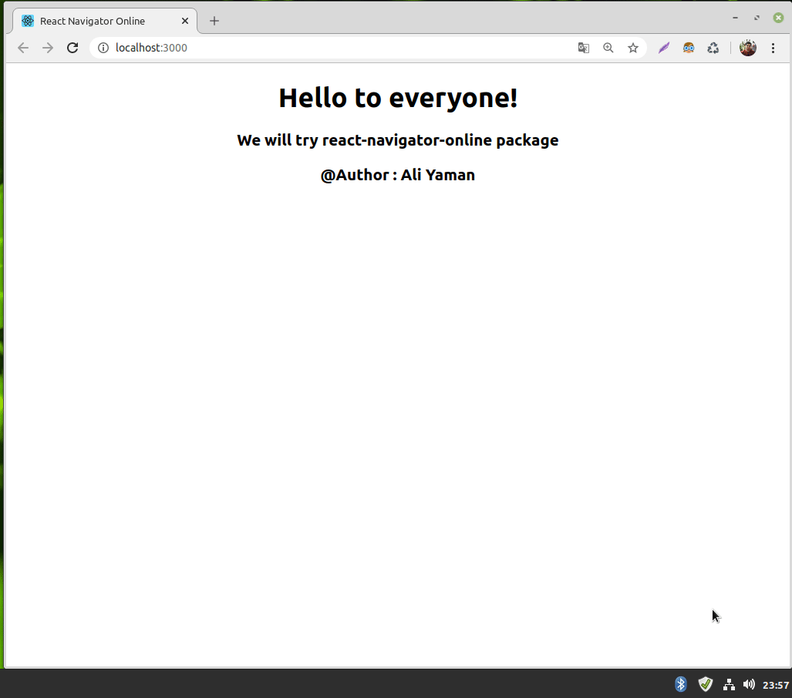

# React Navigator Online
Hi, this package easy to use navigator online. Thanks to this package, you can check internet connection to something or to show popup about internet connection etc.

# Demo

# Installation

    npm install react-navigator-online
    yarn add react-navigator-online

# Example

    import React from 'react';
    import NavigatorOnline from 'react-navigator-online'
    // i want to show it with toastify.
    import { ToastContainer, toast } from 'react-toastify';
    import 'react-toastify/dist/ReactToastify.css';

    class Example extends React.Component {
    constructor(props) {
        super(props);
        this.state = {
            message_online: "now! you have an internet connection.",
            message_ofline: "now! you have no internet connection.",
        };
    }

    showMessage(status) {
        if (status) {
            toast.success(this.state.message_online)
        }
        else {
            toast.error(this.state.message_ofline)
        }
    }

    render() {
        return (
        

            

                <h1>Hello to everyone!</h1>
                <h3>We will try react-navigator-online package</h3>
                <h3>@Author : Ali Yaman</h3>
            

            <ToastContainer
                position="bottom-left"
                autoClose={5000}
                hideProgressBar={false}
                newestOnTop={false}
                closeOnClick
                rtl={false}
                pauseOnVisibilityChange
                draggable
                pauseOnHover
                onClose={() => alert("ok")}
            />

            // we can get status this onChange function like this.
            <NavigatorOnline onChange={(status) => this.showMessage(status)} />

        

        );
    }
    }

    export default Example;
